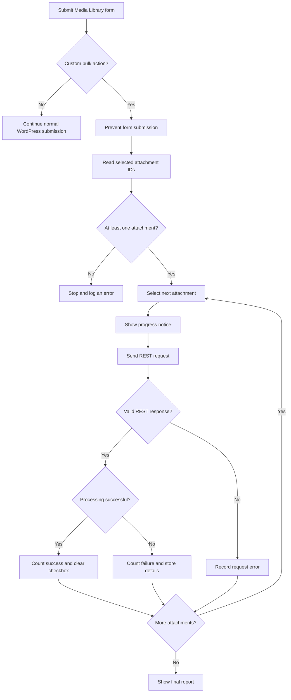
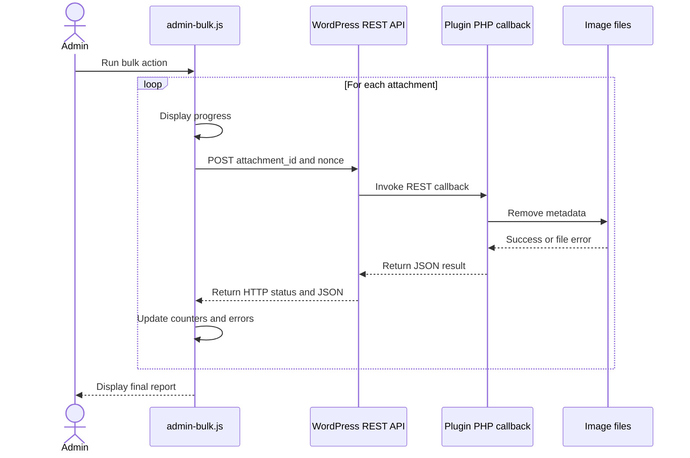
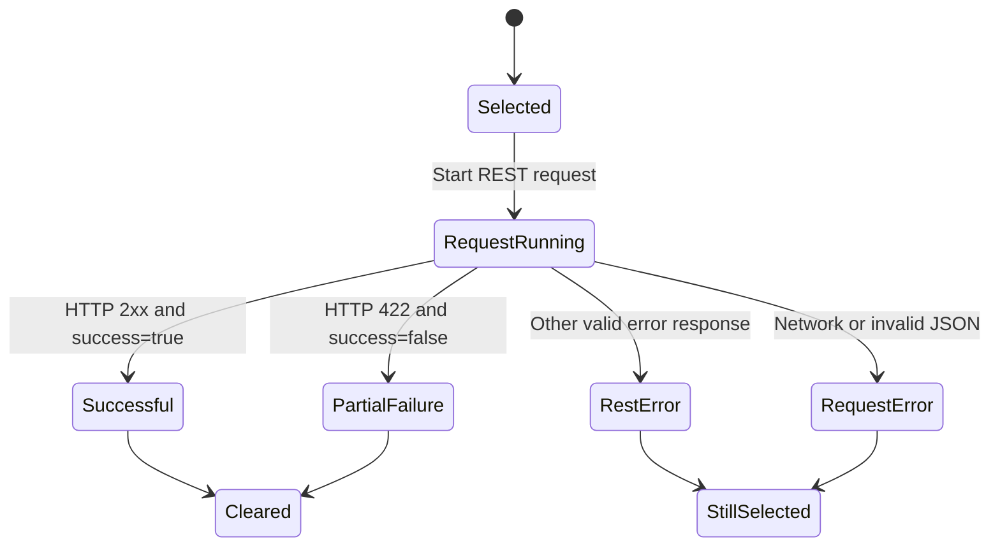

# Client-Side Bulk Processing in the WordPress Media Library

This document explains the JavaScript implementation in `admin-bulk.js`. The script adds client-side batch processing to a custom bulk action in the WordPress Media Library list view.

Instead of submitting all selected images in one long-running request, the script sends one REST API request per attachment and waits for each request to finish before starting the next one. This makes progress visible, keeps errors attributable to individual images, and prevents a single failure from terminating the entire batch.

## Overview

The script has four main responsibilities:

| Area | Responsibility |
| --- | --- |
| Initialization and event handling | Detect submission of the Media Library bulk action |
| REST communication | Send one `fetch()` request per attachment |
| Result processing | Count successful and failed attachments and files |
| User interface | Display progress, final statistics, and detailed errors |

The implementation uses functions rather than classes. Activity, sequence, and state diagrams therefore describe it more clearly than a class diagram. See at the bottom in Design Characteristics for an assessment of this workflow.

## Contents
- [Client-Side Bulk Processing in the WordPress Media Library](#client-side-bulk-processing-in-the-wordpress-media-library)
	- [Overview](#overview)
	- [Contents](#contents)
	- [Requirements and WordPress context](#requirements-and-wordpress-context)
	- [Initialization](#initialization)
	- [Detecting the selected bulk action](#detecting-the-selected-bulk-action)
	- [Reading the selected attachments](#reading-the-selected-attachments)
	- [Batch workflow](#batch-workflow)
	- [Sequential processing](#sequential-processing)
	- [Progress notice](#progress-notice)
	- [REST request](#rest-request)
		- [Request sequence](#request-sequence)
	- [Expected REST response](#expected-rest-response)
	- [Response validation](#response-validation)
	- [Success criteria](#success-criteria)
	- [HTTP 422 semantics](#http-422-semantics)
	- [REST errors and request errors](#rest-errors-and-request-errors)
		- [Valid REST error response](#valid-rest-error-response)
		- [Request or response failure](#request-or-response-failure)
	- [Defensive result helpers](#defensive-result-helpers)
	- [Batch counters](#batch-counters)
	- [Attachment states](#attachment-states)
	- [Updating the WordPress checkboxes](#updating-the-wordpress-checkboxes)
	- [Final report](#final-report)
	- [Dismissible notice](#dismissible-notice)
	- [Safe DOM output](#safe-dom-output)
	- [Design characteristics](#design-characteristics)
	- [Known limitations](#known-limitations)


## Requirements and WordPress context

The script is intended for the WordPress Media Library **list view**. It expects the standard Media Library form:

```html
<form id="posts-filter">
```

It also expects a global configuration object supplied by PHP, typically through `wp_localize_script()` or `wp_add_inline_script()`:

```js
const wpStripImageMetadata = {
	restUrl: 'https://example.org/wp-json/namespace/route',
	nonce: 'wordpress-rest-nonce',
};
```

The object must contain:

| Property | Purpose |
| --- | --- |
| `restUrl` | URL of the plugin's REST endpoint |
| `nonce` | WordPress REST nonce used to authorize the request |

The custom bulk action must use this value:

```text
wp_strip_image_metadata
```

## Initialization

The script waits until the DOM is ready:

```js
document.addEventListener('DOMContentLoaded', () => {
	const mediaForm = document.getElementById('posts-filter');
```

It then verifies that the selected element is an HTML form:

```js
if (!(mediaForm instanceof HTMLFormElement)) {
	return;
}
```

If the Media Library form does not exist, the script exits without affecting the page. This also makes it safe if the script is accidentally loaded on another WordPress admin screen.

A `submit` listener is registered on the form:

```js
mediaForm.addEventListener('submit', async (event) => {
```

Both the upper and lower **Apply** buttons in the WordPress list table submit the same form, so a single listener handles both controls.

## Detecting the selected bulk action

WordPress provides two bulk-action fields:

```js
select[name="action"]
select[name="action2"]
```

The first belongs to the controls above the table and the second to those below it. `getSelectedBulkAction()` checks both fields and ignores the WordPress default value `-1`, which means that no action is selected.

The custom processing logic runs only when the selected value is `wp_strip_image_metadata`:

```js
const action = getSelectedBulkAction(mediaForm);

if (action !== 'wp_strip_image_metadata') {
	return;
}
```

All other WordPress bulk actions continue with their normal form submission.

For the custom action, the standard submission is stopped:

```js
event.preventDefault();
```

From that point onward, JavaScript and the WordPress REST API control the batch.

## Reading the selected attachments

`getSelectedAttachmentIds()` finds all selected Media Library checkboxes:

```js
input[name="media[]"]:checked
```

Their values are converted to integers and filtered so that only positive integer IDs remain. The result is an array such as:

```js
[123, 127, 140]
```

If no valid attachment has been selected, processing stops and an error is written to the browser console. The code for a visible WordPress admin notice exists but is currently commented out because it is handled by WordPress globally. Using it in the JS would lead to doubled notices.

## Batch workflow

The complete high-level workflow is:



The central loop processes the selected attachments:

```js
for (const [index, attachmentId] of attachmentIds.entries()) {
```

For each attachment, the script:

1. displays the current progress;
2. sends a REST request;
3. waits for the response;
4. updates its counters;
5. records any error details;
6. proceeds to the next attachment.

## Sequential processing

The request is awaited inside the loop:

```js
const restResponse = await processAttachment(attachmentId);
```

The next attachment is not submitted until the current request has completed. Requests are therefore **sequential**, not parallel.

This has several useful properties:

- only one request from this batch is active at a time;
- short-term server load is limited;
- concurrent changes to image files are less likely;
- each result can be assigned to exactly one attachment;
- one failed attachment does not stop the remaining batch.

## Progress notice

Before every request, the current notice is replaced with a progress message:

```js
showSelectionNotice(
	`Processing image ${index + 1} of ${attachmentIds.length}, `
		+ `ID ${attachmentId}. Please wait...`,
	'info'
);
```

An example message is:

```text
Processing image 3 of 25, ID 471. Please wait...
```

The generated markup uses standard WordPress admin notice classes:

```html
<div id="wp-strip-image-metadata-bulk-notice" class="notice notice-info">
	<p>Processing image 3 of 25, ID 471. Please wait...</p>
</div>
```

The notice is inserted immediately after the main heading selected by `.wrap > h1`.

## REST request

`processAttachment()` sends one attachment ID to the configured endpoint:

```js
fetch(wpStripImageMetadata.restUrl, {
	method: 'POST',
	credentials: 'same-origin',
	headers: {
		'Content-Type': 'application/json',
		'X-WP-Nonce': wpStripImageMetadata.nonce,
	},
	body: JSON.stringify({
		attachment_id: attachmentId,
	}),
});
```

| Request option | Purpose |
| --- | --- |
| `method: 'POST'` | Sends a state-changing request |
| `credentials: 'same-origin'` | Includes the current WordPress login cookies |
| `Content-Type: application/json` | Declares a JSON request body |
| `X-WP-Nonce` | Authenticates and protects the REST request |
| `attachment_id` | Identifies the attachment to process |

### Request sequence



## Expected REST response

A successful response is expected to resemble:

```json
{
	"success": true,
	"attachment_id": 123,
	"filename": "example.jpg",
	"processed_paths": 4,
	"failed_paths": 0,
	"message": "",
	"messages": []
}
```

A partially or completely failed attachment may return:

```json
{
	"success": false,
	"attachment_id": 123,
	"filename": "example.jpg",
	"processed_paths": 3,
	"failed_paths": 1,
	"message": "One or more files could not be processed.",
	"messages": [
		"Metadata could not be removed from thumbnail-150x150.jpg."
	]
}
```

The distinction between attachments and paths is important. A single WordPress attachment can reference several physical files, for example:

- the original upload;
- a scaled main image;
- thumbnails and other registered image sizes, called subsizes.

Consequently, processing 10 attachments may involve 50 or more image files.

## Response validation

The response is first parsed as JSON:

```js
try {
	responseData = await response.json();
} catch {
	throw new Error(
		`The server returned an invalid response. `
			+ `HTTP status: ${response.status}.`
	);
}
```

Parsing can fail when the server returns something other than JSON, such as:

- an nginx or Apache error page;
- HTML generated by a PHP warning;
- an empty response;
- an HTML response for HTTP 502 or 504.

The parsed value must also be a non-null object. The normalized return value of `processAttachment()` is:

```js
{
	ok: response.ok,
	status: response.status,
	data: responseData,
}
```

This normalization matters because `fetch()` does not reject its promise merely because the server returns HTTP 422 or 500. Such responses still reach the normal result-handling path if they contain valid JSON.

## Success criteria

An attachment is considered fully successful only when both conditions are true:

```js
restResponse.ok
	&& result.success === true
```

`restResponse.ok` requires an HTTP status in the range 200–299. The response body must additionally contain the exact Boolean value `true` in `success`.

For a successful attachment, the script:

- increments `successfulAttachments`;
- writes the result to the browser console;
- clears the attachment checkbox;
- continues with the next attachment.

## HTTP 422 semantics

HTTP 422 is treated as a regular, structured response for an attachment that was processed but had one or more file-level errors:

```js
if (
	restResponse.status === 422
	&& result.success === false
) {
	unselectAttachment(mediaForm, attachmentId);
}
```

The checkbox behavior is therefore:

| Result | Attachment checkbox |
| --- | --- |
| HTTP 2xx and `success: true` | Cleared |
| HTTP 422 and `success: false` | Cleared |
| Other valid REST error | Remains selected |
| Network failure or invalid response | Remains selected |

The reasoning is that a 422 response represents a completed and understood server-side operation, even though individual files failed. By contrast, an interrupted request or unusable server response leaves the attachment selected so that the administrator can retry it.

## REST errors and request errors

The implementation distinguishes between two error categories.

### Valid REST error response

If the server returns valid JSON with an unsuccessful HTTP status or `success: false`, `createResultErrorEntry()` produces a normalized error object:

```js
{
	attachmentId,
	filename,
	message,
	messages,
	httpStatus,
}
```

This preserves the HTTP status and detailed messages returned by the PHP implementation.

### Request or response failure

The `catch` block handles failures for which no usable REST result is available, including:

- network interruptions;
- invalid JSON;
- an invalid JSON structure;
- a proxy or web-server error page.

The resulting error entry is:

```js
{
	attachmentId,
	filename: '',
	message,
	messages: [],
	httpStatus: null,
}
```

The filename, HTTP status, and PHP details may be unavailable because the script did not receive a valid application response. The attachment remains selected for a later retry.

## Defensive result helpers

Several helper functions normalize possibly incomplete REST data:

| Function | Behavior |
| --- | --- |
| `getResultAttachmentId()` | Uses the response ID or falls back to the requested ID |
| `getNumericValue()` | Converts a result property to a finite number or returns `0` |
| `getResultFilename()` | Returns a trimmed non-empty filename or an empty string |
| `getResultMessage()` | Returns the server message or a generic HTTP error message |
| `getResultMessages()` | Keeps only non-empty strings from the detailed message array |

These functions prevent missing or malformed optional properties from breaking the final report.

## Batch counters

The script maintains four counters:

```js
let successfulAttachments = 0;
let failedAttachments = 0;
let processedPaths = 0;
let failedPaths = 0;
```

| Counter | Meaning |
| --- | --- |
| `successfulAttachments` | Attachments processed without an error |
| `failedAttachments` | Attachments with at least one error |
| `processedPaths` | Physical image files processed successfully |
| `failedPaths` | Physical image files that failed |

The path counters are also collected from unsuccessful REST results. This allows the report to represent partial success within a single attachment.

## Attachment states



## Updating the WordPress checkboxes

`unselectAttachment()` clears the checkbox belonging to one attachment:

```js
checkbox.checked = false;
```

It then dispatches a bubbling `change` event:

```js
checkbox.dispatchEvent(
	new Event('change', {
		bubbles: true,
	})
);
```

This allows WordPress and other admin scripts to react to the programmatic change.

If the batch contains no failed attachments, the upper and lower **Select all** checkboxes are also reset:

```text
#cb-select-all-1
#cb-select-all-2
```

Their `indeterminate` state is cleared as well.

## Final report

After the last attachment, `showFinalReport()` receives the complete result:

```js
showFinalReport({
	totalAttachments: attachmentIds.length,
	successfulAttachments,
	failedAttachments,
	processedPaths,
	failedPaths,
	errors,
});
```

If no attachment failed, the report uses:

```text
notice notice-success is-dismissible
```

If at least one attachment failed, it uses:

```text
notice notice-error is-dismissible
```

The summary reports both attachment-level and file-level results, for example:

```text
8 of 10 images were processed successfully.
42 files were stripped.
2 files failed.
```

For every failed attachment, the detailed report may include:

- the filename or title;
- the attachment ID;
- the HTTP status, if known;
- a general error message;
- detailed messages returned by the PHP logger.

## Dismissible notice

The final notice receives its own dismiss button:

```html
<button type="button" class="notice-dismiss">
	<span class="screen-reader-text">Dismiss this notice.</span>
</button>
```

The `screen-reader-text` element provides an accessible label. Clicking the button removes the complete notice from the DOM.

## Safe DOM output

Text received from the REST endpoint is inserted with `textContent`, not `innerHTML`:

```js
generalMessage.textContent = errorEntry.message;
```

The browser therefore treats server messages as plain text instead of executable markup. This reduces the risk of cross-site scripting through an error message.

## Design characteristics

The implementation provides the following behavior:

- it intercepts only the plugin's own bulk action;
- it reuses the standard WordPress Media Library selection controls;
- it sends a separate REST request for every attachment;
- it processes requests sequentially;
- it continues after individual failures;
- it presents immediate progress information;
- it preserves detailed server-side error messages;
- it keeps technically unfinished attachments selected for retry;
- it uses WordPress admin notice styling;
- it inserts external text using safe DOM APIs.

## Known limitations

The batch is controlled by the browser. Consequently:

- the browser tab must remain open;
- navigating away or closing the tab interrupts the batch;
- network interruptions require retry or resume behavior;
- processing is not truly asynchronous on the server;
- the current implementation does not disable the form, action selectors, or Apply buttons while a batch is running;
- another administrator or another browser tab can start a competing batch;
- the script is designed for the Media Library list view, not the grid view.

Because the controls remain enabled during processing, the same user can accidentally start a second batch before the first one finishes. Preventing duplicate submissions would require an additional running-state guard and temporary disabling of the relevant controls.
